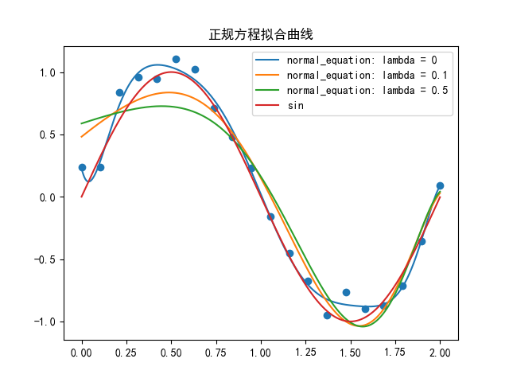
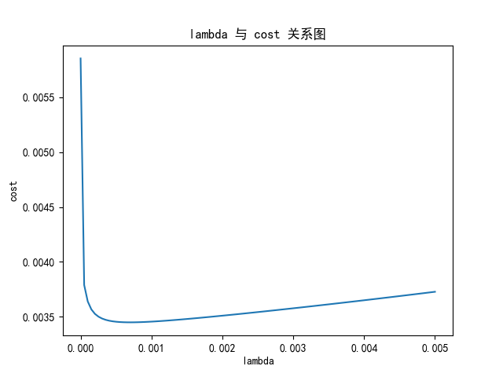
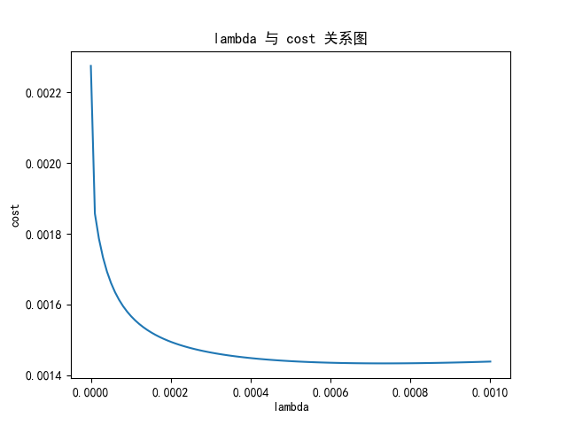
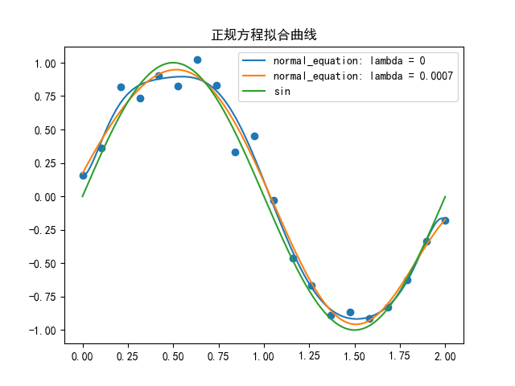
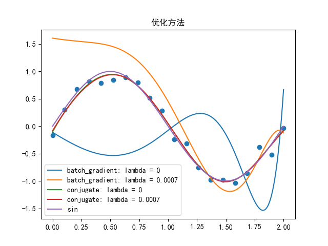
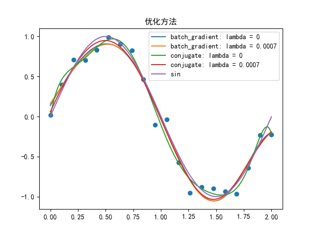
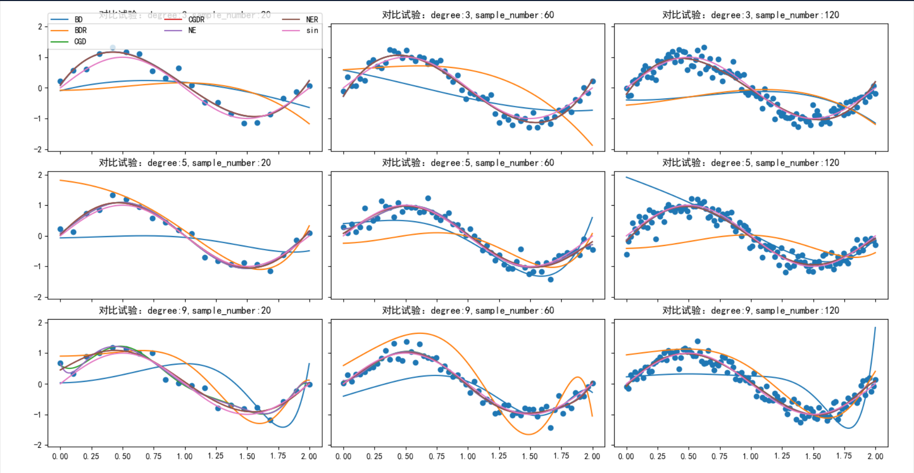
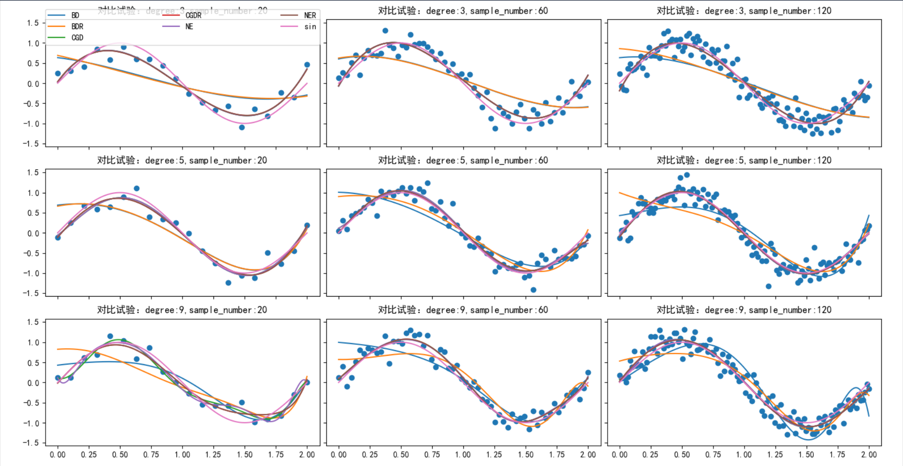
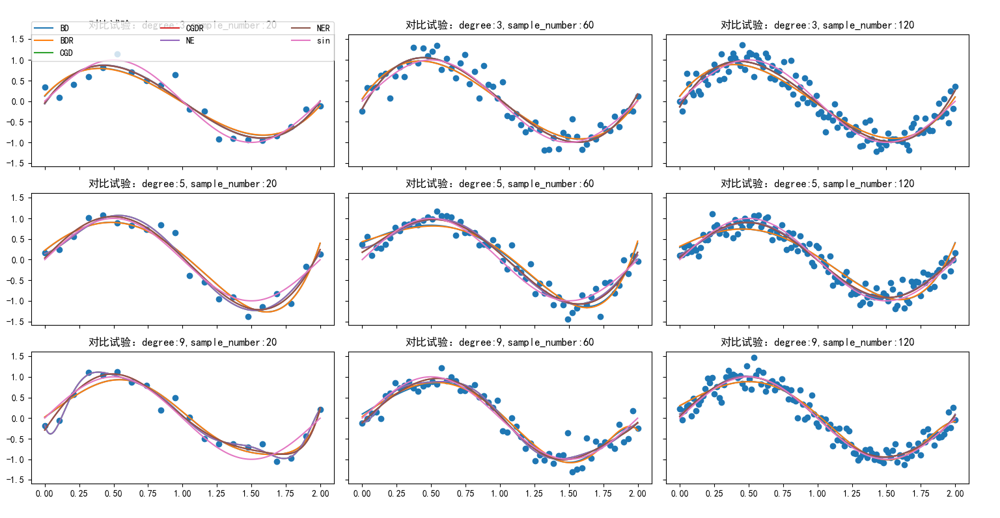

&nbsp;
&nbsp;
&nbsp;
&nbsp;
<center> <font size = 6> 哈尔滨工业大学计算学部 </font></center>
&nbsp;
&nbsp;
&nbsp;
&nbsp;

<center> <font size = 12> 实验报告 </font></center>

&nbsp;
&nbsp;

<center><font size = 5> 
课程名称：机&nbsp;&nbsp;&nbsp;&nbsp;&nbsp;&nbsp;器&nbsp;&nbsp;&nbsp;&nbsp;&nbsp;&nbsp;学&nbsp;&nbsp;&nbsp;&nbsp;&nbsp;&nbsp;习

课程类型：&nbsp;&nbsp;&nbsp;&nbsp;&nbsp;&nbsp;选&nbsp;&nbsp;&nbsp;&nbsp;&nbsp;&nbsp;&nbsp;&nbsp;&nbsp;&nbsp;&nbsp;&nbsp;&nbsp;修&nbsp;&nbsp;&nbsp;&nbsp;&nbsp;&nbsp;
实验题目：多项式拟合正弦函数 
</font> </center>

<center> <font size = 5> 学号：1190201019 </font></center>
<center> <font size = 5> 姓名：罗家乐 </font></center>

<div STYLE="page-break-after: always;"></div>

# 一、实验目的

掌握最小二乘法求解（无惩罚项的损失函数）、掌握加惩罚项（2范数）的损失函数优化、梯度下降法、共轭梯度法、理解过拟合、克服过拟合的方法(如加惩罚项、增加样本)

# 二、实验要求及实验环境

## 实验要求

1. 生成数据，加入噪声；
2. 用高阶多项式函数拟合曲线；
3. 用解析解求解两种loss的最优解（无正则项和有正则项）
4. 优化方法求解最优解（梯度下降，共轭梯度）
5. 用你得到的实验数据，解释过拟合。
6. 用不同数据量，不同超参数，不同的多项式阶数，比较实验效果。
7. 语言不限，可以用matlab，python。求解解析解时可以利用现成的矩阵求逆。梯度下降，共轭梯度要求自己求梯度，迭代优化自己写。不许用现成的平台，例如pytorch，tensorflow的自动微分工具。

## 实验环境

**Programming Language**: python 3.9.2 64-bit

**Imported Model**: numpy matplotlib

# 三、设计思想（本程序中的用到的主要算法及数据结构）

## 数据生成

```python
def get_data(sample_number,degree,function=np.sin):
    base = np.linspace(start = 0, stop= 2, num = sample_number, endpoint = True)
    Y = np.array([_y + np.random.normal(loc=0,scale=0.1) for _y in function(base*np.pi)])
    X = np.array([[np.power(x,l) for l in range(0,degree+1)] for x in base])
    return X,Y
```
利用numpy库中的linspace函数，生成0-2之间的等差数列，其数量满足sample_number，得到训练样本横轴。使用列表生成式，生成带有高斯噪声的数据Y，以及生成映射为degree阶的多项式向量组成的范德蒙德矩阵X。

## 数据拟合

使用多项式对$\sin(\pi x)$函数进行拟合,即使用线性回归，对从$x$映射为$[x^0 x^1 x^2 x^3 x^4 ... x^n]$的特征使用参数$\theta$进行内积，使其输出接近$\sin(\pi x)$. $$h(x)=\theta^Tx \tag{1}$$PS:$x^0=1,\theta^0$为b故上列公式已考虑到了偏差b。

```python
def hypnosis_X(theta):
    def hypnosis(x):
        return np.dot(np.power(x,range(0,len(theta))).T,theta)
    return hypnosis
```

对于拟合的效果进行评价，使用MLE从高斯分布的假设中导出代价函数-最小均方，再加上正则项。$$J(\theta) = \frac{1}{2m} \sum_{i = 1}^{m} \{h_{\theta}(x_i) - y_i\}^2 + \frac{\lambda}{2 m} \sum_{j=1}^{n} \theta_{j}^{2}\tag{2}$$$J(\theta)$计算代码如下:

```python
def cost(X,y,theta,_lambda):
    return 1/(2*len(y))*((X.dot(theta)-y).T.dot((X.dot(theta)-y).T)+_lambda*theta.T.dot(theta))
```

为提高拟合效果，优化目标为$$\argmin\limits_{\theta} J(\theta)$$


## 正规方程（解析）求 $\theta$

正规方程求解，即直接求解$J(\theta)$对$\theta$的梯度$\nabla_{\theta} J(\theta)$为0的$\theta$的值。

$$
\begin{aligned}
\nabla_{\theta} J(\theta)&=\nabla_{\theta} \frac{1}{2}(X \theta-\vec{y})^{T}(X \theta-\vec{y}) \\
&=\frac{1}{2} \nabla_{\theta}\left(\theta^{T} X^{T} X \theta-\theta^{T} X^{T} \vec{y}-\vec{y}^{T} X \theta+\vec{y}^{T} \vec{y}\right) \\
&=\frac{1}{2} \nabla_{\theta} \operatorname{tr}\left(\theta^{T} X^{T} X \theta-\theta^{T} X^{T} \vec{y}-\vec{y}^{T} X \theta+\vec{y}^{T} \vec{y}\right) \\
&=\frac{1}{2} \nabla_{\theta}\left(\operatorname{tr} \theta^{T} X^{T} X \theta-2 \operatorname{tr} \vec{y}^{T} X \theta\right) \\
&=\frac{1}{2}\left(X^{T} X \theta+X^{T} X \theta-2 X^{T} \vec{y}\right) \\
&=X^{T} X \theta-X^{T} \vec{y}
\end{aligned}
$$

使该式子等于0，变换形式后，公式如下：

$$\theta = (X^TX+\lambda E)^{-1}X^T\vec{y}$$

代码较为简单，实现如下：

```python
def normal_equation(X,Y,_lambda):
    return np.linalg.inv(X.T.dot(X)+_lambda*np.eye(X.shape[1])).dot(X.T).dot(Y)
```

## 批量梯度下降法求 $\theta$

梯度下降法，即通过多轮迭代，在每一轮将 $\theta$ 向该处的$\nabla_{\theta} J(\theta)$的反方向进行少量移动，在凸函数的前提下，最终，$\theta$ 将使得$\nabla_{\theta} J(\theta)=0$。 而每一轮都用全部训练样本对梯度进行计算，即批量梯度下降法。

梯度计算代码：

```python
def gradient(theta, X, Y,_lambda):
    m = X.shape[0]
    gradient = X.T.dot((X.dot(theta) - Y)) + _lambda*theta
    return gradient/m
```

批量梯度下降代码：

```python
def batch_gradient_descent(X,Y,theta,_lambda,alpha,iter_num,accuracy,gradient,cost,is_obvious):
    c = cost(X,Y,theta,_lambda)
    cost_history = []
    new_theta = theta.copy()
    for i in range(0,iter_num):
        new_theta = new_theta - alpha * gradient(new_theta,X,Y,_lambda)
        if cost(X,Y,new_theta,_lambda)<c:
            old_c = c
            c = cost(X,Y,new_theta,_lambda)
            cost_history.append(c)
            if old_c - c<accuracy:
                break
        else:
            alpha=alpha/2
        if is_obvious:
            if i%10000==0:
                print(alpha,c)
    return new_theta,cost_history
```

## 共轭梯度下降法求 $\theta$

共轭梯度的主要思想在于找出互相共轭的一组基向量，通过在互相共轭的基向量方向是进行学习，就可以做到每一步的学习都对之前的学习不造成影响，从而可以在有限步内将$\theta$优化到最佳。
其伪代码如下：
>$$
\mathbf{r}_{0}:=\mathbf{b}-\mathbf{A} \mathbf{x}_{0}$$if $\mathbf{r}_{0}$ is sufficiently small, then return $\mathbf{x}_{0}$ as the result
$$
\begin{aligned}
&\mathbf{p}_{0}:=\mathbf{r}_{0} \\
&k:=0
\end{aligned}
$$repeat
$$
\begin{aligned}
\alpha_{k}: &=\frac{\mathbf{r}_{k}^{T} \mathbf{r}_{k}}{\mathbf{p}_{k}^{T} \mathbf{A} \mathbf{p}_{k}} \\
\mathbf{x}_{k+1} &:=\mathbf{x}_{k}+\alpha_{k} \mathbf{p}_{k} \\
\mathbf{r}_{k+1} &:=\mathbf{r}_{k}-\alpha_{k} \mathbf{A} \mathbf{p}_{k}
\end{aligned}
$$if $\mathbf{r}_{k+1}$ is sufficiently small, then exit loop
$$
\begin{aligned}
&\beta_{k}:=\frac{\mathbf{r}_{k+1}^{T} \mathbf{r}_{k+1}}{\mathbf{r}_{k}^{T} \mathbf{r}_{k}} \\
&\mathbf{p}_{k+1}:=\mathbf{r}_{k+1}+\beta_{k} \mathbf{p}_{k} \\
&k:=k+1
\end{aligned}
$$
end repeat
return $\mathbf{x}_{k+1}$ as the result

按照伪代码进行实现：

```python
def conjugate(X,Y,_lambda,accuracy):
    A = X.T.dot(X)+_lambda*np.eye(X.shape[1])
    b = X.T.dot(Y)
    x = np.zeros(shape=(X.shape[1],))
    r = b
    p = r
    while True:
        alpha = r.T.dot(r) / (p.T.dot(A).dot(p))
        x = x + alpha*p
        next_r = r - alpha * A.dot(p)
        if next_r.T.dot(next_r) < accuracy:
            break
        beta = next_r.T.dot(next_r)/(r.T.dot(r))
        p = next_r + beta * p
        r = next_r
    return x
```

# 四、实验结果与分析

## 1 正规方程（解析解）

拟合曲线：sin(2πx)
多项式阶数：9
拟合区间：[0,2]
训练样本数量：20

<center></center>

发现不带正则项（$\lambda$=0）的解析解拟合效果较好，而带有正则项的解析解，拟合效果欠佳，推测$\lambda$取值不当.

追加实验，对$\lambda$与cost之间的关系进行研究：

<center></center>

初步实验，确定最佳$\lambda$应落在[0,0.001]，进一步细化区间：

<center></center>

进一步实验发现，最佳$\lambda$大约为0.0007。但随着数据的不同，最佳$\lambda$的值也会发生变动，此处但为了方便起见，后续实验直接采用0.0007作为正则化参数。

再次拟合曲线，查看效果：

<center></center>

得到合意的拟合结果，大致为最优解。

## 2 优化方法（梯度下降、共轭梯度下降）

拟合曲线：sin(2πx)
多项式阶数：9
拟合区间：[0,2]
训练样本数量：20
$\lambda$取值：0.0007

<center></center>

<center><font size = 4>精度：0.00001</font></center>

&nbsp;

优化方法拟合效果受精度影响较大，改换精度为，进行测试：

<center></center>

<center><font size = 4>精度：0.0000000001</font></center>

&nbsp;

拟合效果合意。

## 3 改换参数实验结果对比

为进一步探究拟合效果与多项式阶数、数据量之间的关系，改换不同数据量与多项式阶数进行实验（$\lambda$的影响已在正规方程部分进行探究）。实验中，多项式阶级分别为3、5、9阶，训练样本数量分别为20、60、120，同时，由于优化方法受精度影响较大，分别设定精度为$1 \times 10^{-5}$ $1 \times 10^{-7}$ $1 \times 10^{-9}$多次进行实验，得到实验结果如下:

图例解释：

+ BG(R):批量梯度下降（正则化）
+ CG(R):共轭梯度下降（正则化）
+ NE(R):正规方程/解析解（正则化）
+ sin:被拟合曲线sin($\pi$x)

PS：所用正则化参数$\lambda$取值为0.0007

<center></center>

<center><font size = 4>精度：0.00001</font></center>

&nbsp;

<center></center>

<center><font size = 4>精度：0.0000001</font></center>

&nbsp;

<center></center>

<center><font size = 4>精度：0.000000001</font></center>


实验结果分析：

1. 通过比对同一精度下的拟合效果，可以发现：
   + **现象**：随着训练样本数上升（横轴至左向右），不同学习方式的拟合效果都逐步提高
    **解释**：随着采样集合的上升，样本的分布能够更好地表现实际数据集的分布，进而能够使得模型在通过学习训练样本，降低经验风险的时候同时降低结构性风险，提高拟合的准确性。
   + **现象**：随着多项式阶数上升（纵轴自上向下），曲线的拟合效果上升
    **解释**：多项式阶数，表现了模型的复杂度，更高阶数的多项式意味着更为复杂的模型，复杂的模型能够降低偏差（bias），更好地学习数据的分布特征。
2. 对比不同训练样本数量下带正则项与不带正则项的学习方法拟合出的曲线：
   + **现象**：当训练样本数较少时，正则化的曲线，其拟合效果较无正则化的曲线好；而当训练样本数充足时，不带正则项的曲线其拟合效果更好。（由于精度过低与过高时，拟合效果都较为极端，不利于对比，主要关注精度为0.0000001时的实验结果,且过拟合主要发生在解析解与共轭梯度法，梯度下降由于训练始终无法完全收敛，难以表现出过拟合现象）
     **解释**：实际上，这就是机器学习过程中的**过拟合**问题。**过拟合**即模型在学习过程中，将不属于数据整体的分布的，而属于所取得的训练样本集中数据的某些特征误认为数据总体的特征，并将其学习，纳入考量，使得模型习得了一些错误的特征，而在真正的数据上表现较差。在我们的实验中，表现为过于注重训练样本点的分布，拟合出了较为复杂的曲线形状，而与真正的待拟合函数sin相去甚远。
     **正则化**的加入，能够通过乘法过于复杂的模型，控制模型的复杂度，使其无法对训练样本集中的部分特征进行过度学习，使其更为符合数据的真正分布。然而，过度的正则化，将过分简化模型，使其无法对训练样本集合中的数据总体分布特征进行学习，导致模型不能反应数据的总体分布。
     回到实验结果，当训练样本较少时，训练样本特征无法反应数据总体特征，较高阶的模型容易过拟合，加入正则项能够减少过拟合，使其模拟效果更好；而训练样本充分时，训练样本分布能够反应数据整体的分布，模型对其的学习不容易过拟合，而这时，（过大的）正则化反而阻碍了模型对数据分布的学习（曲线的拟合），此时，无（过大）正则项的模型拟合效果更好。
3. 对比不同精度下的优化方法：
   + **现象**：精度越高，拟合效果越好
    **解释**：优化方法，即梯度下降法，通过逐步改变 $\theta$ 使其能够更好地拟合。优化方法需要多次迭代，更高的精度，就要求着优化方法经历更多轮次的迭代，因而学习耗时也会提高。

# 五、结论

在本次实验中，我使用多项式对sin($x\pi$)在[0,2]区间上进行拟合，使用由最大似然推导出的最小二乘法（有/无正则项）作为代价函数作为优化目标进行学习。

## 1 掌握学习方法

在实验过程中，我通过编程：

1. 实现了基于正规方程（解析解）的求解方法，并通过实验，寻找到了最适合的$\lambda$超参数，得到了最优解。
2. 实现了梯度下降法，设置了相对合理的学习率与其下降方式。了解了共轭梯度下降原理，并按照伪代码进行实现。

## 2 理解过拟合

通过变换参数进行对比实验，实践理解了过拟合的**机理**：

过拟合即模型的学习降低了经验风险，而未能降低结构风险，导致模型在训练集上表现出色，而无法适应训练集以外的数据样本。这往往发生在训练集过小（训练样本过少），无法表达数据的整体分布，而导致模型对训练样本的非整体特征进行过度学习。

因此克服过拟合可以从以下两个方面入手：

1. 增加学习样本的表现能力：通过增加样本，样本的总体表现将更能代表数据的真正分布，从而可以通过降低经验风险来降低结构风险，得以泛化到训练样本外的数据样本上。
2. 通过增加正则项，降低模型的复杂度，降低其学习能力，从而避免模型对训练样本私有特征的过分学习。但正则项参数$\lambda$过大将导致模型学习能力过低，甚至无法学习到训练样本中对总体分布特征的表现。

# 六、参考文献

*CS229 Lecture notes,Andrew Ng*
*https://zh.wikipedia.org/zh-hans/%E5%85%B1%E8%BD%AD%E6%A2%AF%E5%BA%A6%E6%B3%95*


# 七、附录：源代码（带注释）

```python
import matplotlib.pyplot as plt
import numpy as np

#初始化Theta
def get_theta(n):
    return np.array([value + np.random.normal(loc=0,scale=1) \
        for value in np.zeros(shape = (n,))])

#计算代价
def cost(X,y,theta,_lambda):
    return 1/(2*len(y))*((X.dot(theta)-y).T.\
        dot((X.dot(theta)-y).T)+_lambda*theta.T.dot(theta))

#获取数据
def get_data(sample_number,degree,is_scatter=True,function=np.sin):
    base = np.linspace(start = 0, stop= 2, \
        num = sample_number, endpoint = True)
    Y = np.array([_y + np.random.normal(loc=0,scale=0.2) \
        for _y in function(base*np.pi)])
    X = np.array([[np.power(x,l) for l in range(0,degree+1)] for x in base])
    if(is_scatter):
        plt.scatter(base,Y)
    return X,Y

#假设方程
def hypnosis_X(theta):
    def hypnosis(x):
        return np.dot(np.power(x,range(0,len(theta))).T,theta)
    return hypnosis

def normal_equation(X,Y,_lambda):
    return np.linalg.inv(X.T.dot(X)+_lambda*np.eye(X.shape[1])).dot(X.T).dot(Y)

#求梯度
def gradient(theta, X, Y,_lambda):
    m = X.shape[0]
    gradient = X.T.dot((X.dot(theta) - Y)) + _lambda*theta
    return gradient/m

#批量梯度下降
def batch_gradient_descent(X,Y,theta,_lambda,alpha,iter_num,accuracy,gradient,cost,is_obvious):
    c = cost(X,Y,theta,_lambda)
    cost_history = []
    new_theta = theta.copy()
    for i in range(0,iter_num):
        new_theta = new_theta - alpha * gradient(new_theta,X,Y,_lambda)
        if cost(X,Y,new_theta,_lambda)<c:
            old_c = c
            c = cost(X,Y,new_theta,_lambda)
            cost_history.append(c)
            if old_c - c<accuracy:
                break
        else:
            alpha=alpha/1.2
        if is_obvious:
            if i%10000==0:
                print(alpha,c)
    return new_theta,cost_history

#共轭梯度下降
def conjugate(X,Y,_lambda,accuracy):
    A = X.T.dot(X)+_lambda*np.eye(X.shape[1])
    b = X.T.dot(Y)
    x = np.zeros(shape=(X.shape[1],))
    r = b
    p = r
    while True:
        alpha = r.T.dot(r) / (p.T.dot(A).dot(p))
        x = x + alpha*p
        next_r = r - alpha * A.dot(p)
        if next_r.T.dot(next_r) < accuracy:
            break
        beta = next_r.T.dot(next_r)/(r.T.dot(r))
        p = next_r + beta * p
        r = next_r
    return x

#绘图
def plot(start,end,step,type,functions,title,single_deal = True):
    x = np.arange(start,end,step)
    if type =="plot":
        for function,name in functions.items():
            plt.plot(x,[function(_x) for _x in x],label= name)
            plt.title(title)
        if single_deal:
            plt.legend(loc = "best")
            plt.rcParams['font.sans-serif'] = ['SimHei']
            plt.rcParams['axes.unicode_minus']=False 
            plt.show()

#正规方程
def Normal_1(X,Y):
    theta1 = normal_equation(X,Y,0)
    theta2 = normal_equation(X,Y,0.1)
    theta3 = normal_equation(X,Y,0.5)
    plot(0,2,0.001,"plot",{hypnosis_X(theta1):"normal_equation: lambda = 0",\
                            hypnosis_X(theta2):"normal_equation: lambda = 0.1",\
                            hypnosis_X(theta3):"normal_equation: lambda = 0.5",\
                            lambda x:np.sin(x*np.pi):"sin"},"正规方程拟合曲线")
    
#第二次正规方程
def Normal_2(X,Y):
    theta1 = normal_equation(X,Y,0)
    theta2 = normal_equation(X,Y,0.0007)
    plot(0,2,0.001,"plot",{hypnosis_X(theta1):"normal_equation: lambda = 0",\
                            hypnosis_X(theta2):"normal_equation: lambda = 0.0007",\
                            lambda x:np.sin(x*np.pi):"sin"},"正规方程拟合曲线")


#梯度下降实验
def Grad_(X,Y,accuracy):#13 9 7
    theta1,_ = batch_gradient_descent(X,Y,get_theta(10),\
        0,0.0001,10000000000,accuracy,gradient,cost,True)
    theta2,_ = batch_gradient_descent(X,Y,get_theta(10),\
        0.0007,0.0001,10000000000,accuracy,gradient,cost,True)
    theta3 = conjugate(X,Y,0,accuracy)
    theta4 = conjugate(X,Y,0.0007,accuracy)
    plot(0,2,0.001,"plot",{hypnosis_X(theta1):"batch_gradient: lambda = 0",\
                            hypnosis_X(theta2):"batch_gradient: lambda = 0.0007",\
                            hypnosis_X(theta3):"conjugate: lambda = 0",\
                            hypnosis_X(theta4):"conjugate: lambda = 0.0007",\
                            lambda x:np.sin(x*np.pi):"sin"},"优化方法")

#探究最佳lambda
def lambda_chooser(X,Y):
    base = np.linspace(0,0.01,30,endpoint=True)
    test_x = np.arange(0,2,0.0001)
    test_y = np.sin(test_x*np.pi)
    costs = []
    for _lambda in base:
        theta = normal_equation(X,Y,_lambda)
        costs.append(cost(np.array([[np.power(_x,l)\
            for l in range(0,10)] for _x in test_x]),test_y,theta,0))
    plt.plot(base,costs,label = "cost of lambda")
    plt.xlabel("lambda")
    plt.ylabel("cost")
    plt.title("lambda 与 cost 关系图")
    plt.rcParams['font.sans-serif'] = ['SimHei']
    plt.rcParams['axes.unicode_minus']=False 
    plt.show()
    
#对比实验
def compare_(degrees,sample_numbers):
    
    x_len = len(degrees)
    y_len = len(sample_numbers)
    accuracy = 0.000000001
    
    plt.subplots(x_len,y_len,sharex = True, sharey = True)
    for degree in degrees:
        for sample_number in sample_numbers:
            plt.subplot(x_len,y_len,degrees.index(degree)*y_len+sample_numbers.\
                index(sample_number)+1)
            X,Y = get_data(sample_number,degree,True)
            theta1,_ = batch_gradient_descent(X,Y,get_theta(degree+1),\
                0,0.0001,10000000000,accuracy,gradient,cost,True)
            theta2,_ = batch_gradient_descent(X,Y,get_theta(degree+1),\
                0.0007,0.0001,10000000000,accuracy,gradient,cost,True)
            theta3 = conjugate(X,Y,0,accuracy)
            theta4 = conjugate(X,Y,0.0007,accuracy)
            theta5 = normal_equation(X,Y,0)
            theta6 = normal_equation(X,Y,0.0007)
            plot(0,2,0.001,"plot",{hypnosis_X(theta1):"BD",\
                                    hypnosis_X(theta2):"BDR",\
                                    hypnosis_X(theta3):"CGD",\
                                    hypnosis_X(theta4):"CGDR",\
                                    hypnosis_X(theta5):"NE",\
                                    hypnosis_X(theta6):"NER",\
                                    lambda x:np.sin(x*np.pi):"sin"},\
                                        "对比试验：degree:{},sample_number:{}"\
                                        .format(degree,sample_number),False)
    plt.rcParams['font.sans-serif'] = ['SimHei']
    plt.rcParams['axes.unicode_minus']=False
    plt.subplot(x_len,y_len,1)
    plt.legend(bbox_to_anchor=(0,0.8,1,0.2), loc="lower left",
                mode="expand", borderaxespad=0, ncol=3)
    plt.show()

if __name__ == "__main__":
    
    #第一次解析解
    X,Y = get_data(20,9)
    Normal_1(X,Y)
    plt.cla()
    
    #求解最佳lambda
    lambda_chooser(X,Y)
    
    #使用最佳lambda求解析解
    X,Y = get_data(20,9)
    Normal_2(X,Y)
    plt.cla()
    
    #梯度下降，精度0.00001
    X,Y = get_data(20,9)
    Grad_(X,Y,0.00001)
    plt.cla()
    
    #梯度下降，精度0.000000001
    X,Y = get_data(20,9)
    Grad_(X,Y,0.0000000001)
    plt.cla()

    #对比试验
    degrees = [3,5,9]
    sample_numbers = [20,60,120]
    compare_(degrees,sample_numbers)

```