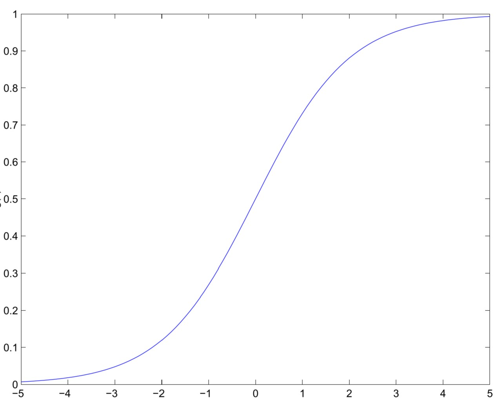
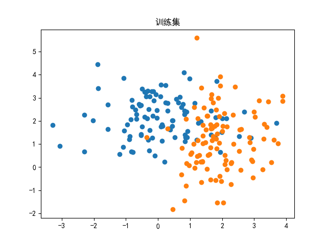
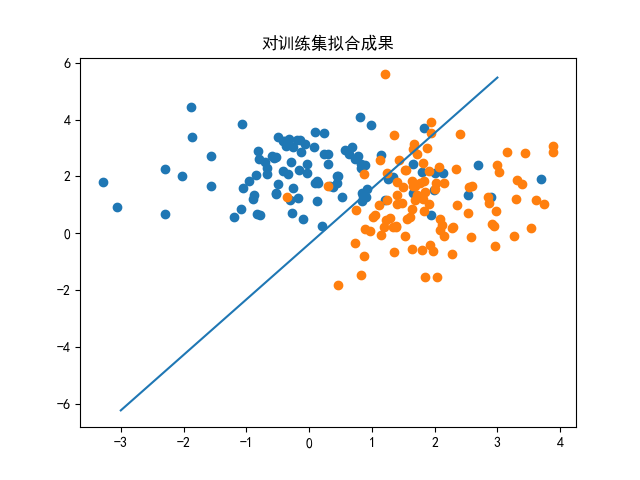
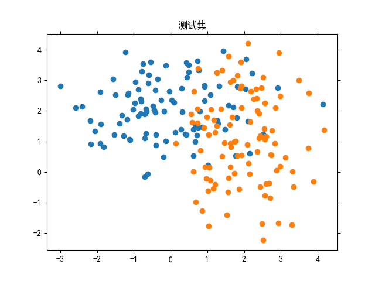
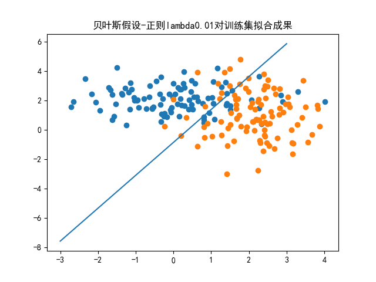
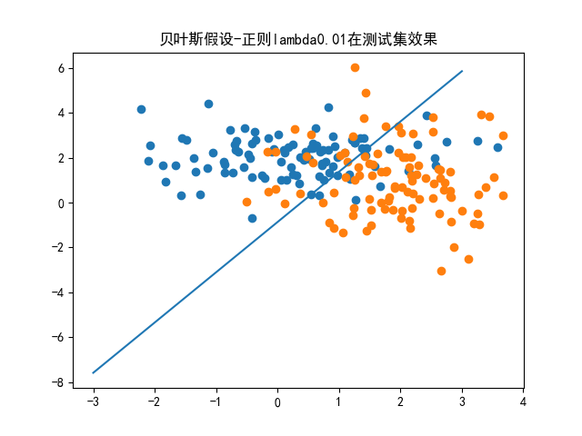
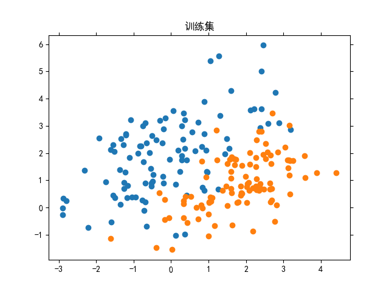
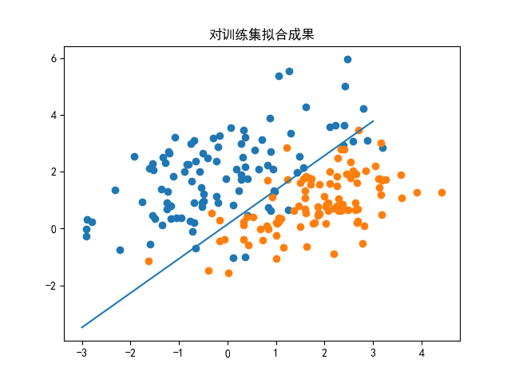
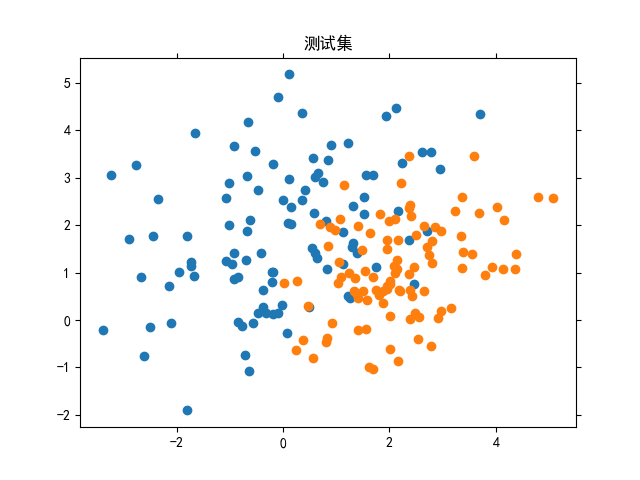
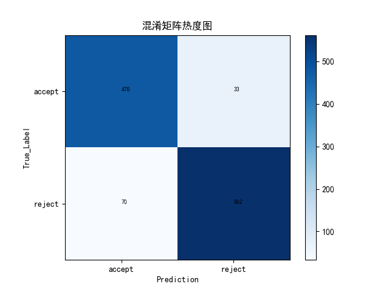

&nbsp;
&nbsp;
&nbsp;
&nbsp;
<center> <font size = 6> 哈尔滨工业大学计算学部 </font></center>
&nbsp;
&nbsp;
&nbsp;
&nbsp;

<center> <font size = 12> 实验报告 </font></center>

&nbsp;
&nbsp;

<center><font size = 5> 
课程名称：机&nbsp;&nbsp;&nbsp;&nbsp;&nbsp;&nbsp;器&nbsp;&nbsp;&nbsp;&nbsp;&nbsp;&nbsp;学&nbsp;&nbsp;&nbsp;&nbsp;&nbsp;&nbsp;习

课程类型：&nbsp;&nbsp;&nbsp;&nbsp;&nbsp;&nbsp;选&nbsp;&nbsp;&nbsp;&nbsp;&nbsp;&nbsp;&nbsp;&nbsp;&nbsp;&nbsp;&nbsp;&nbsp;&nbsp;修&nbsp;&nbsp;&nbsp;&nbsp;&nbsp;&nbsp;
实验题目：逻&nbsp;&nbsp;&nbsp;&nbsp;&nbsp;&nbsp;辑&nbsp;&nbsp;&nbsp;&nbsp;&nbsp;&nbsp;回&nbsp;&nbsp;&nbsp;&nbsp;&nbsp;&nbsp;归
</font> </center>

<center> <font size = 5> 学号：1190201019 </font></center>
<center> <font size = 5> 姓名：罗家乐 </font></center>

<div STYLE="page-break-after: always;"></div>

# 一、实验目的

目的：理解逻辑回归模型，掌握逻辑回归模型的参数估计算法。

# 二、实验要求及实验环境

## 实验要求

要求：实现两种损失函数的参数估计（1.无惩罚项；2.加入对参数的惩罚），可以采用梯度下降、共轭梯度或者牛顿法等。

## 实验环境

**Programming Language**: python 3.9.7 64-bit

**Imported Model**: numpy matplotlib sklearn.datasets sklearn.metrics

# 三、设计思想（本程序中的用到的主要算法及数据结构）

## 批量梯度下降法求 $\theta$

梯度下降法，即通过多轮迭代，在每一轮将 $\theta$ 向该处的$\nabla_{\theta} J(\theta)$的反方向进行少量移动，在凸函数的前提下，最终，$\theta$ 将使得$\nabla_{\theta} J(\theta)=0$。 而每一轮都用全部训练样本对梯度进行计算，即批量梯度下降法。

批量梯度下降代码：

```python
#批量梯度下降
def batch_gradient_descent(X,Y,theta,_lambda,alpha,iter_num,accuracy,gradient,cost,is_obvious):
    c = cost(X,Y,theta,_lambda)
    cost_history = []           #记录损失
    new_theta = theta.copy()
    for i in range(0,iter_num):
        new_theta = new_theta - alpha * gradient(X,Y,new_theta,_lambda)
        if cost(X,Y,new_theta,_lambda)<c:
            old_c = c
            c = cost(X,Y,new_theta,_lambda)
            cost_history.append(c)
            if old_c - c<accuracy:
                break
        else:
            alpha=alpha/1.1
        if is_obvious:
            if i%10==0:         #每隔10次打印一次alpha步长与损失
                print(alpha,c)
    return new_theta,cost_history
```

## 逻辑回归模型

实验一中我们使用多项式函数对目标函数在特定区间上进行拟合，实际上是应用线性回归模型，对目标函数在特定区间上取得的数据集进行学习，从而达到使多项式达到拟合的效果。

线性回归模型在数值学习领域有较广泛的应用，然而在分类领域，其效果并不好。

作为一种常用的分类模型，逻辑回归是对线性回归模型的拓展。通过使用sigmoid函数，逻辑回归模型将线性回归计算的结果从实数域映射到[0,1]上，从而克服了线性模型在分类问题上的缺陷。

### sigmoid函数

sigmoid函数：$$\text{sigmoid}(Z) = \frac{1}{(1+e^{-Z})}$$

其曲线如下：

<center></center>

sigmoid函数能够将数据映射到[0,1]上，并保持单增性，这使得其在机器学习领域得到了广泛的应用。

### sigmoid函数的缺陷

sigmoid函数存在两种等价形式:

$$\text{sigmoid}(Z) = \frac{1}{(1+e^{-Z})} = \frac{e^Z} {(e^Z + 1)}$$

当Z为很小的负数时，$\frac{1}{(1+e^{-Z})}$中在计算$e^{-Z}$时，由于数值过大，容易发生溢出；当Z为很大的正数时，$\frac{e^Z} {(e^Z + 1)}$中在计算$e^{Z}$时，同样容易溢出。所以在实现时，需要判断Z的正负，使用不同的计算方法，防止溢出。

sigmoid代码如下：

```python
def sigmoid(Z):   
    mask = (Z > 0)
    positive_out = np.zeros_like(Z, dtype='float64')
    negative_out = np.zeros_like(Z, dtype='float64')
    positive_out = 1 / (1 + np.exp(-Z, positive_out, where=mask))
    positive_out[~mask] = 0
    expZ = np.exp(Z,negative_out,where=~mask)
    negative_out = expZ / (1+expZ)
    negative_out[mask] = 0
    return positive_out + negative_out
```

### 逻辑回归数学表示

逻辑回归模型表示如下：
$$
h_{\theta}(x)=\frac{1}{1+e^{-\theta^{T} x}}
$$

其中$h_{\theta}(x)$表示的是给定数据属于$y$的可能性，即：
$$
\begin{aligned}
&P(y=1 \mid x ; \theta)=h_{\theta}(x) \\
&P(y=0 \mid x ; \theta)=1-h_{\theta}(x)
\end{aligned}
$$
可以统一写作：
$$
p(y \mid x ; \theta)=\left(h_{\theta}(x)\right)^{y}\left(1-h_{\theta}(x)\right)^{1-y}
$$

### 逻辑回归优化目标

其似然函数如下：
$$
\begin{aligned}
L(\theta)&=\prod_{i=1}^{m} p\left(y^{(i)} \mid x^{(i)} ; \theta\right) \\
&=\prod_{i=1}^{m}\left(h_{\theta}\left(x^{(i)}\right)\right)^{y^{(i)}}\left(1-h_{\theta}\left(x^{(i)}\right)\right)^{1-y^{(i)}}
\end{aligned}
$$
从最大似然的角度出发，我们希望能够求得：

$$ \theta_{ML} = \argmax_{\theta}L(\theta)$$

为了便于计算，通过使用具有单增性的对数函数，我们的优化目标转为：
$$
\begin{aligned}
\log L(\theta) &=\sum_{i=1}^{m} (y^{(i)} \log h\left(x^{(i)}\right)+\left(1-y^{(i)}\right) \log \left(1-h\left(x^{(i)}\right)\right))
\end{aligned}
$$
取相反数，得到损失函数：

$$
\begin{aligned}
cost(\theta) &=\sum_{i=1}^{m} (-y^{(i)} \log h\left(x^{(i)}\right)-\left(1-y^{(i)}\right) \log \left(1-h\left(x^{(i)}\right)\right))
\end{aligned}
$$

同理，从MAP的角度出发:

$$ \theta_{MAP} = \argmax_{\theta}\prod_{i=1}^{m} p\left(y^{(i)} \mid x^{(i)} ; \theta\right)p(\theta)$$

我们则可以得到带正则项的损失函数：
$$
\begin{aligned}
cost(\theta) &=\sum_{i=1}^{m} (y^{(i)} \log h\left(x^{(i)}\right)+\left(1-y^{(i)}\right) \log \left(1-h\left(x^{(i)}\right)\right)+\lambda {\theta}^2)
\end{aligned}
$$

实际实现中，改换系数，便于后续求梯度，及防止损失函数受样本数量影响：

$$
\begin{aligned}
cost(\theta) &=\frac{1}{m}\sum_{i=1}^{m} (-y^{(i)} \log h\left(x^{(i)}\right)-\left(1-y^{(i)}\right) \log \left(1-h\left(x^{(i)}\right)\right)+\frac{\lambda}{2}{\theta}^2)
\end{aligned}
$$

便于计算，向量化：

$$cost(\theta) = \frac{1}{m}(-\vec{y}^T\log sigmoid(X\theta)-(1-\vec{y})^T\log (1-sigmoid(X\theta)))+\frac{\lambda}{2m}{\theta}^2 $$

对参数项惩罚与否，代码皆可以实现如下（仅需设置$\lambda$的值为0，即可等价于无参数项惩罚）。

```python
def logistic_cost(X,y,theta,_lambda):
    m = X.shape[0]
    return 1/m*(-y.T.dot(np.log(sigmoid(X.dot(theta))))-\
                (1-y).T.dot(np.log(1-sigmoid(X.dot(theta)))))+_lambda/(2*m)*theta.T.dot(theta)
```


### 逻辑回归梯度

为了使用梯度下降法优化模型，还需要求出损失函数的梯度(向量化)如下：

$$ gradient(\theta) = \frac{1}{m}(X^Tsigmoid(X\theta-\vec{y}))+\frac{\lambda}{m}\theta $$

同代价/损失函数，对参数项惩罚与否，代码皆可以实现如下（仅需设置$\lambda$的值为0，即可等价于无参数项惩罚）。

```python
def logistic_gradient(X,y,theta,_lambda):
    m = X.shape[0]
    return 1/m*(X.T.dot(sigmoid(X.dot(theta))-y)\
        +_lambda*theta)
```

# 四、实验、结果与分析

## 实验1 线性回归模型学习条件无关高斯集

逻辑回归模型可以由高斯判别模型，加之特征之间条件无关的条件导出，故先使用特征间条件无关的数据进行测试。

使用numpy数据计算模块，生成两个条件无关的二维高斯分布：

$ Gaussian1:mean = [0,2], cov = \begin{pmatrix} 1.5 & 0 \\ 0 & 0.8 \end{pmatrix}$
$Gaussian2:mean=[2,1],cov=\begin{pmatrix} 0.8 & 0 \\ 0 & 2 \end{pmatrix} $

训练集如下:

<center></center>

使用逻辑回归模型建模，设正则系数$\lambda$为0，即无正则化，训练后：

<center></center>

可以观测到，决策边界较好地切分了训练集，使两个类尽可能落在两边。但由于训练集并不严格线性可分，故还是存在误判点。

使用相同参数生成测试集：

<center></center>

在测试集上效果：

<center></center>

泛化后效果仍旧不错。

## 实验2 线性回归模型学习条件无关高斯集-正则化

使用同样参数，生成数据集，设正则化系数为0.01进行训练，结果如下：

<center></center>

<center></center>

正则化条件下，逻辑回归模型分类效果仍旧显著。但在大数据集下，抑制过拟合效果不明显。

## 实验3 线性回归模型学习非条件无关高斯集

逻辑回归模型亦可不由高斯判别导出，因此不满足贝叶斯假设理应照常有效。

使用numpy数据计算模块，生成两个条件相关的二维高斯分布：

$ Gaussian1:mean = [0,2], cov = \begin{pmatrix} 2 & 1 \\ 1 & 2 \end{pmatrix}$
$Gaussian2:mean=[2,1],cov=\begin{pmatrix} 1 & 0.5 \\ 0.5 & 1 \end{pmatrix} $

训练集如下:

<center></center>

使用逻辑回归模型建模，训练后：

<center></center>

可以观测到，决策边界较好地切分了训练集，使两个类尽可能落在两边。但由于训练集并不严格线性可分，故还是存在误判点。

使用相同参数生成测试集：

<center></center>

在测试集上效果：

<center></center>

泛化后效果仍旧不错。

可以看到，就算数据集不满足贝叶斯假设，逻辑回归模型仍旧有效。

## 逻辑回归模型应用于UCI实际数据集

从UCI的数据库中找寻到一个适合分类问题的数据集：
$$\text{Farm Ads Data Set}$$

**描述**：该数据集包含了从12个网站上收集来的，与农场动物主题相关的4000余份文本形式广告。该数据集中，使用54877个单词生成的词典作为特征（对应位置的单词出现，则设置为1；否则为0），并按照SVMlight format进行组织。其对应标签为，网站内容拥有者是否满意（接受）对应的广告（1表示接受，-1表示不接受）。

将数据集分为两个部分，前3000为训练集；后1000余份为测试集。在训练集上训练线性回归模型，在测试集上进行测试，得到混淆矩阵如下:

<center></center>

可以观测到，预测结果与真实标签较为一致，仅存在少量误判，预测效果尚可。

# 五、结论

通过本次对逻辑回归的实验，我：

1. 逻辑回归是一种有效的线性分类器，当样本在特征空间线性可分时，完成训练的模型能够将样本有效分割；当样本在特征空间中非线性可分时，模型将尽可能分类样本，降低损失，但只有将样本映射到高维空间后才能够做到完全分类。
2. 逻辑回归不依赖于贝叶斯假设，即样本特征之间条件无关。事实上，当样本不满足贝叶斯假设，逻辑回归模型依旧拥有相当不错的分类效果。
3. 逻辑回归的样本特征空间不一定是实数空间，其特征在01空间上时，如UCI数据集中的**词典**，逻辑回归也能够达到相对优秀的分类效果。

# 六、参考文献

*CS229 Lecture notes,Andrew Ng*

# 七、附录：源代码（带注释）

```python
import numpy as np
import matplotlib.pyplot as plt
import sklearn.datasets as sk
import os
from sklearn.metrics import confusion_matrix


def generate_data(mean1,cov1,mean2,cov2,size,name):
    '''生成数据集'''
    data1 = np.random.multivariate_normal(mean=mean1,cov=cov1,size = size)
    data2 = np.random.multivariate_normal(mean=mean2,cov=cov2,size = size)
    data1 = np.c_[data1,np.ones(len(data1))]
    data2 = np.c_[data2,np.zeros(len(data2))]
    plt.scatter(data1[:,0],data1[:,1])
    plt.scatter(data2[:,0],data2[:,1])
    plt.title(name)
    plt.rcParams['axes.unicode_minus']=False
    plt.rcParams['font.sans-serif'] = ['SimHei']  # 用来正常显示中文标签
    plt.show()
    plt.scatter(data1[:,0],data1[:,1])
    plt.scatter(data2[:,0],data2[:,1])
    data = np.append(data1,data2,axis=0)
    feature = np.append(np.ones((len(data),1)),data[:,0:-1],axis=1)
    value = data[:,-1].reshape(-1,)
    return feature,value

def generate_theta(dimesion):
    '''生成theta初始值'''
    theta = np.array([value + np.random.normal(loc=0,scale=0.01) \
        for value in np.zeros(shape = (dimesion,))])
    return theta    

def sigmoid(Z):   
    '''做了防溢出处理的sigmoid'''
    mask = (Z > 0)
    positive_out = np.zeros_like(Z, dtype='float64')
    negative_out = np.zeros_like(Z, dtype='float64')
    positive_out = 1 / (1 + np.exp(-Z, positive_out, where=mask))
    positive_out[~mask] = 0
    expZ = np.exp(Z,negative_out,where=~mask)
    negative_out = expZ / (1+expZ)
    negative_out[mask] = 0
    return positive_out + negative_out
    
def logistic_gradient(X,y,theta,_lambda):
    '''逻辑回归的梯度函数'''
    m = X.shape[0]
    return 1/m*(X.T.dot(sigmoid(X.dot(theta))-y)\
        +_lambda*theta)

def logistic_cost(X,y,theta,_lambda):
    '''逻辑回归的代价函数'''
    m = X.shape[0]
    return 1/m*(-y.T.dot(np.log(sigmoid(X.dot(theta))))-\
                (1-y).T.dot(np.log(1-sigmoid(X.dot(theta)))))+_lambda/(2*m)*theta.T.dot(theta)

def batch_gradient_descent(X,Y,theta,_lambda,alpha,iter_num,accuracy,gradient,cost,is_obvious):
    '''实现批量梯度下降'''
    c = cost(X,Y,theta,_lambda)
    cost_history = []
    new_theta = theta.copy()
    for i in range(0,iter_num):
        new_theta = new_theta - alpha * gradient(X,Y,new_theta,_lambda)
        if cost(X,Y,new_theta,_lambda)<c:
            old_c = c
            c = cost(X,Y,new_theta,_lambda)
            cost_history.append(c)
            if old_c - c<accuracy:
                break
        else:
            alpha=alpha/1.1
        if is_obvious:
            if i%10==0:
                print(alpha,c)
    return new_theta,cost_history

def Show_Confusion_Matrix(classes,confusion):
    '''绘制混淆矩阵'''
    plt.imshow(confusion, cmap=plt.cm.Blues)
    indices = range(len(confusion))
    plt.xticks(indices, classes)
    plt.yticks(indices, classes)
    plt.colorbar()
    plt.xlabel('Prediction')
    plt.ylabel('True_Label')
    plt.title("混淆矩阵热度图")
    for first_index in range(len(confusion)):
        for second_index in range(len(confusion[first_index])):
            plt.text(first_index, second_index, confusion[first_index][second_index],fontsize=7)
    plt.rcParams['font.sans-serif'] = ['SimHei']  # 用来正常显示中文标签
    plt.show()

def predict(feature,theta):
    '''预测函数'''
    res = sigmoid(feature.dot(theta))
    prediction = np.zeros(len(feature))
    for i in range(0,len(res)):
        if(res[i]>=0.5):
            prediction[i]=1
    return prediction

def bounder_y(x,theta):
    '''打印决策边界'''
    return (-theta[0]-theta[1]*x)/theta[2] 

def simple_test():
    '''高斯数据实验（贝叶斯假设/非贝叶斯假设）'''
    Gaussian_data_test([0,2],[[1.5,0],[0,0.8]],[2,1],[[0.8,0],[0,2]],100,0,"贝叶斯假设")
    Gaussian_data_test([0,2],[[1.5,0],[0,0.8]],[2,1],[[0.8,0],[0,2]],100,0.01,"贝叶斯假设-正则lambda0.01")
    Gaussian_data_test([0,2],[[2,1],[1,2]],[2,1],[[1,0.5],[0.5,1]],100,0,"非贝叶斯假设")

def Gaussian_data_test(mean1,cov1,mean2,cov2,size,_lambda,title):
    '''高斯数据集实验'''
    feature,value=generate_data(mean1,cov1,mean2,cov2,size,"训练集")
    theta = generate_theta(3)
    theta1,cost_history = batch_gradient_descent(feature,value,theta,_lambda,0.01,100000000,0.000001,logistic_gradient,logistic_cost,True)
    interval = np.linspace(-3,3,100)
    plt.plot(interval,[bounder_y(x,theta1) for x in interval])
    plt.title(title+"对训练集拟合成果")
    plt.rcParams['axes.unicode_minus']=False
    plt.rcParams['font.sans-serif'] = ['SimHei']  # 用来正常显示中文标签
    plt.show()
    plt.cla()
    generate_data(mean1,cov1,mean2,cov2,size,"测试集")
    plt.plot(interval,[bounder_y(x,theta1) for x in interval])
    plt.rcParams['axes.unicode_minus']=False
    plt.title(title+"在测试集效果")
    plt.rcParams['font.sans-serif'] = ['SimHei']  # 用来正常显示中文标签
    plt.show()
    plt.cla()
    
def UCI_test():
    '''UCI数据集实验'''
    feature,label = sk.load_svmlight_file(os.path.join(os.getcwd(),"farm-ads-vect"))#使用特定库解析文本形式的数据集
    feature = feature.toarray()
    for i in range(0,len(label)): #修正-1标签为0
        if label[i]==-1:
            label[i]=0
    feature = np.append(np.ones((len(feature),1)),feature,axis=1)
    theta = generate_theta(len(feature.T))
    training_set = (feature[0:3000],label[0:3000])
    test_set = (feature[3000:],label[3000:])
    #train
    theta,cost= batch_gradient_descent(training_set[0],training_set[1],theta,0,1,1000000000,0.00001,logistic_gradient,logistic_cost,True)
    #test
    prediction=predict(test_set[0],theta)
    #show
    confuse = confusion_matrix(test_set[1],prediction,labels=[0,1])
    Show_Confusion_Matrix(["accept","reject"],confuse)


if __name__ == "__main__":
    simple_test()
    UCI_test()
```
