&nbsp;
&nbsp;
&nbsp;
&nbsp;
<center> <font size = 6> 哈尔滨工业大学计算学部 </font></center>
&nbsp;
&nbsp;
&nbsp;
&nbsp;

<center> <font size = 12> 实验报告 </font></center>

&nbsp;
&nbsp;

<center><font size = 5> 
课程名称：机&nbsp;&nbsp;&nbsp;&nbsp;&nbsp;&nbsp;器&nbsp;&nbsp;&nbsp;&nbsp;&nbsp;&nbsp;学&nbsp;&nbsp;&nbsp;&nbsp;&nbsp;&nbsp;习

课程类型：&nbsp;&nbsp;&nbsp;&nbsp;&nbsp;&nbsp;选&nbsp;&nbsp;&nbsp;&nbsp;&nbsp;&nbsp;&nbsp;&nbsp;&nbsp;&nbsp;&nbsp;&nbsp;&nbsp;修&nbsp;&nbsp;&nbsp;&nbsp;&nbsp;&nbsp;
实验题目：PCA&nbsp;&nbsp;&nbsp;&nbsp;模&nbsp;&nbsp;型&nbsp;&nbsp;实&nbsp;&nbsp;验
</font> </center>

<center> <font size = 5> 学号：1190201019 </font></center>
<center> <font size = 5> 姓名：罗家乐 </font></center>

<div STYLE="page-break-after: always;"></div>

# 一、实验目的

实现一个PCA模型，能够对给定数据进行降维（即找到其中的主成分）

# 二、实验要求及实验环境

## 实验要求

（1）首先人工生成一些数据（如三维数据），让它们主要分布在低维空间中，如首先让某个维度的方差远小于其它唯独，然后对这些数据旋转。生成这些数据后，用你的PCA方法进行主成分提取。
（2）找一个人脸数据（小点样本量），用你实现PCA方法对该数据降维，找出一些主成分，然后用这些主成分对每一副人脸图像进行重建，比较一些它们与原图像有多大差别（用信噪比衡量）。


## 实验环境

**Programming Language**: python 3.9.7 64-bit

**Imported Model**: numpy matplotlib  numpy.random.multivariate_normal pickle pillow

# 三、设计思想（本程序中的用到的主要算法及数据结构）

## 1 概述

主成分分析(Principal Component Analysis,PCA)算法是一种常用的数据分析方法。其为M维的数据寻找一个D维度的子空间，使得D空间的基互相正交、线性无关，摒除原M维空间中线性相关性较强的冗余数据。常被用于降低数据维度、数据压缩、数据可视化、特征提取。

## 2 算法推导

PCA的算法推导主要从两个方面入手:

1. Maximum Variance Formulation
2. Minimum Error Formulation

### 2.1 Maximum Variance Formulation

PCA算法将高维空间D中的数据投影到一组新基组成的空间M中。在这个过程中，我们希望尽可能多地保留有效信息。Maximum variance Formulation推导就是从尽可能多保留信息的角度出发进行地推导。

对于数据而言，降维后投影到新的基向量上，将导致信息的部分损失，选择不同的投影方向，得到的结果也不同。

举例，对于以下数据
@import "report file/Origin.png"

我们可以选择这样的轴：

@import "report file/Good.png"

数据落在新基上，较为分散，也保留了数据在原始空间中的特征。

而若我们选择这样一个方向：

@import "report file/Bad.png"

数据点之间的距离很近，可分性较差，对于原始空间中在一、三象限上的距离特征没能得到很好的保留。

故，为了保留尽可能多的特征，我们需要选择使得投影后数据可分性较大的新基，而方差正是可分性的一个好的度量。于是得到优化目标：

$$\argmax_{u_i}\frac{1}{N} \sum_{n=1}^{N}\left\{\mathbf{u}_{i}^{T} \mathbf{x}_{n}-\mathbf{u}_{i}^{T} \overline{\mathbf{x}}\right\}^{2}=\mathbf{u}_{i}^{T} \mathbf{S} \mathbf{u}_{i}$$

其中：

$$\begin{aligned}
\overline{\mathbf{x}} &=\frac{1}{N} \sum_{n=1}^{N} \mathbf{x}_{n} \\
\mathbf{S} &=\frac{1}{N} \sum_{n=1}^{N}\left(\mathbf{x}_{n}-\overline{\mathbf{x}}\right)\left(\mathbf{x}_{n}-\overline{\mathbf{x}}\right)^{T}
\end{aligned}$$

同时，由于$u_i$为基，需要满足：

$$||u_i||=1 \rightarrow u_i^Tu_i=1$$

在这里使用在SVM算法推导中使用过的**拉格朗日乘子法**，改换优化目标为：

$$\argmax_{u_i}\mathbf{u}_{i}^{T} \mathbf{S} \mathbf{u}_{i}+\lambda\left(1-\mathbf{u}_{i}^{T} \mathbf{u}_{i}\right)$$

使其导数等于0，得到:

$$\mathbf{S} \mathbf{u}_{i}=\mathbf{\lambda}_{i} \mathbf{u}_{i}$$

可知$\mathbf{\lambda}_{i}$为协方差矩阵$\mathbf{S}$的特征向量，而$\mathbf{u}_{i}$为$\mathbf{S}$对应$\mathbf{\lambda}_{i}$的特征值。

等式两边同左乘$\mathbf{u}_{i}^T$得到:

$$\mathbf{u}_{i}^T\mathbf{S} \mathbf{u}_{i}=\mathbf{\lambda}_{i}$$

此时，最优化的$\mathbf{u}_{i}$即为主成分，而我们的优化目标也即寻找特征值最大的特征向量。

### 2.2 Minimum Error Formulation

Maximum Variance Formulation从将数据映射到低维空间，同时保留尽可能多的数据的角度来考量优化目标，而Minimum Error Formulation则希望找到一组低维空间M的基来尽可能接近地表示高维空间D中的数据，造成尽量少的误差。

找一组标准正交基$\{u_1,……,u_D\}$，使得D维原始空间中的数据$\mathbf{x}$可以表示为:

$$\mathbf{x}_{n}=\sum_{i=1}^{D} \alpha_{n i} \mathbf{u}_{i}, \quad \alpha_{n i}=\mathbf{x}_{n}^{T} \mathbf{u}_{i}$$

现在需要用其中前M个基来表示原始数据，可以写作下式:

$$\tilde{\mathbf{x}}_{n}=\sum_{i=1}^{M} z_{n i} \mathbf{u}_{i}+\sum_{i=M+1}^{D} b_{i} \mathbf{u}_{i}$$

计算用M维基与用D维基表示出来的数据之间的误差：

$$J=\frac{1}{N} \sum_{n=1}^{N}\left\|\mathbf{x}_{n}-\tilde{\mathbf{x}}_{n}\right\|^{2}$$

展开计算可得优化目标：

$$\argmin_{u_i} J=\frac{1}{N} \sum_{n=1}^{N} \sum_{i=M+1}^{D}\left(\mathbf{x}_{n}^{T} \mathbf{u}_{i}-\overline{\mathbf{x}}^{T} \mathbf{u}_{i}\right)^{2}=\sum_{i=M+1}^{D} \mathbf{u}_{i}^{T} \mathbf{S} \mathbf{u}_{i}$$

按照Maximum Variance Formulation 中相同的方法使用拉格朗日乘子法，可得：

$$\argmin_{\lambda_i}J=\sum_{i=M+1}^{D} \lambda_{i}$$

且基$u_i$即为协方差矩阵的特征向量，$\lambda_i$为特征向量对应的特征值。故，我们需要选择的被省略的基为特征值最小的特征向量对应的基；反之，应当保留的基即为特征值较大的M个特征向量。

至此，得到与Maximum Variance Formulation推导同样的结果。

## 3 代码实现

仿照sklearn中提供的PCA库的接口实现自己的PCA类。其中，特征值、特征向量的计算借用了numpy提供的linalg中的eig函数。

使用流程如下:

1. 设定目标维度
2. 使用fit，针对给定数据进行PCA模型拟合。
3. 使用transform函数将测试数据降维。
4. 使用inverse_transform函数重构测试数据。

值得注意的是，预先对原始数据进行了中心化，方便了后续协方差矩阵的计算；但在处理测试数据与重构数据时需要分别减去与加上均值。

```python
class PCA:
    '''主成分分析'''
    
    def __init__(self,n_components):
        '''初始化设定目标维度'''
        self.n_components = n_components
    
    def fit(self,X):
        '''拟合数据'''
        self.m = len(X)
        self.n = len(X.T)
        self.mean = np.mean(X,axis=0)
        st_X = X-self.mean
        eigen_value,eigen_vector = self.eigen(st_X)#求特征值和特征向量
        sortIndex = np.flipud( np.argsort(eigen_value) ) #特征值排序
        self.explained_variance_ = eigen_value[sortIndex[0:self.n_components]]
        self.explained_variance_ratio_ = eigen_value[sortIndex[0:self.n_components]]/np.sum(eigen_value)
        self.components= eigen_vector[sortIndex[0:self.n_components]]
    
    def eigen(self,X):
        '''计算特征向量、值'''
        Covariance_matrix = np.cov(X,rowvar=False)
        eigen_value,eigen_vector = np.linalg.eig(Covariance_matrix)
        return np.real(eigen_value),np.real(eigen_vector.T)
    
    def transform(self,X):
        '''降维'''
        X = X-self.mean
        Y = X.dot(self.components.T)
        return Y
    
    def inverse_transform(self,Y):
        '''重构'''
        if len(Y.shape)>1:
            X = np.zeros((Y.shape[0],self.n))
            for i in range(Y.shape[0]):
                for j in range(self.n_components):
                    X[i] += Y[i,j]*self.components[j]
        else:
            X = np.zeros((self.n,))
            for i in range(self.n_components):
                X += Y[i]*self.components[i]
        X = X+self.mean
        return X    
```

# 四、实验、结果与分析

## 1 二维数据降一维

### 1.1 思路

使用numpy random 模块中的multivariate_normal生成二维空间数据，控制某维方差较小，使用PCA进行降维重构。

### 1.2 代码

```python
def test1():
    X = multivariate_normal([-1,4],[[1,0],[0,0.2]],size = 30)
    pca = PCA(1)
    pca.fit(X)
    Y = pca.transform(X)
    new_X = pca.inverse_transform(Y)
    plt.figure(1)
    plt.scatter(X[:,0],X[:,1])#原始数据
    plt.scatter(new_X[:,0],new_X[:,1])#构成数据
    
    vector = pca.components[0]
    vector_to_draw = np.vstack([vector*-5,vector*5])+pca.mean
    plt.plot(vector_to_draw[:,0],vector_to_draw[:,1])
    plt.legend()
    plt.show()
```

### 1.3 结果

@import "report file/Test1.png"

可以看到，通过降维，PCA保留了数据在横轴上较大幅度变化的信息，而在纵轴上较小的变化信息（变化幅度从刻度观察）则保留较少，重构后的数据能够保留较多的信息。

## 2 三维数据降二维

### 2.1 思路

三维数据降至二维与二维数据降至一维类似，但可以通过添加绕轴旋转，丰富数据的表现。

### 2.2 代码

```python
def test2():
    X = multivariate_normal([-1,4,5],[[1,0,0],[0,1,0],[0,0,0.01]],size = 100)
    pca = PCA(2)
    pca.fit(X)
    Y = pca.transform(X)
    new_X = pca.inverse_transform(Y)
    fig = plt.figure(1)
    ax = fig.add_subplot(projection='3d')
    ax.scatter(X[:,0],X[:,1],X[:,2])#原始数据
    ax.scatter(new_X[:,0],new_X[:,1],new_X[:,2])#构成数据
    vector = pca.components[0]
    vector_to_draw = np.vstack([vector*-5,vector*5])+pca.mean
    ax.plot(vector_to_draw[:,0],vector_to_draw[:,1],vector_to_draw[:,2])
    vector = pca.components[1]
    vector_to_draw = np.vstack([vector*-5,vector*5])+pca.mean
    ax.plot(vector_to_draw[:,0],vector_to_draw[:,1],vector_to_draw[:,2])
    plt.show()
```

### 2.3 结果

@import "report file/Test2.png"

重构的数据落在二维平面上，但是仍旧保留了原始数据的大部分特征。

## 3 人脸图像处理

### 3.1 思路

对人脸数据进行压缩、降维，以便于人脸识别器的训练与使用，是PCA的常见用途之一。本着动漫人物与人大差不差的思路，本次实验，通过使用1700余张50$\times$50的动漫人物头像灰度图，将其向量化为2500维的向量，进行PCA。再挑选测试样本进行压缩与重构，观测效果。

### 3.2 模型训练

本着实验精神，使用全部1777个样本进行PCA模型训练，尝试1,3,5,10,20,40,80,100,200,300,1000共11个维度，并将模型序列化存储，免去每次训练的时间。训练集示例如下：

<p align="center"></p>

代码如下：

```python
def Face_PCA_training(n_componets):
    sample_directory = os.path.join(os.getcwd(),"trainning_sample")
    model_dirctory = os.path.join(os.getcwd(),"model")
    file_list = os.listdir(sample_directory)
    X=[]
    for file in file_list:
        im = Image.open(os.path.join(sample_directory,file))
        X.append(np.array(im).reshape((-1,)))
    X = np.array(X).reshape((len(file_list),-1))
    pca = PCA(n_components=n_componets)
    pca.fit(X)
    with open(os.path.join(model_dirctory,"PCA{}".format(n_componets)),"wb") as f:
        pk.dump(pca,f)
```

### 3.3 测试

使用几张动漫人物头像作为测试样例：

<p align="center">Orign </p>

分别使用维度1 40 80 200 1000的PCA模型对其进行压缩重构，结果如下：

<p align="center">PCA1 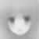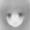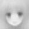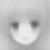</p>
<p align="center">PCA10 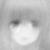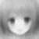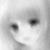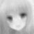</p>
<p align="center">PCA40 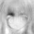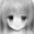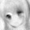</p>
<p align="center">PCA80 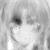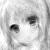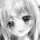</p>
<p align="center">PCA200 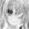</p>
<p align="center">PCA1000 </p>

观察可知，当PCA维度较低，为1、10时，基本不具备可辨识度，到达40时，人物具有一定的特征，可以互相区分，但是仍旧无法与原有样本联系；到达80，初步可以判断角色；200维、乃至1000维时，可以清晰地判断人物，效果极佳。

为了数字化体现结果，引入图像处理中常用的信噪比概念：

$$M S E=\frac{1}{m n} \sum_{i=0}^{m-1} \sum_{j=0}^{n-1}\|I(i, j)-K(i, j)\|^{2}$$

$$P S N R=10 \cdot \log _{10}\left(\frac{M A X_{I}^{2}}{M S E}\right)$$

使用信噪比对重构效果进行数字化、可视化解释：

@import "report file/psnr.png"

可以观测到信噪比随着维度上升逐步提高，与图片愈发清晰的现象相符合。但是，达不到人脸图片仅5-10维即可达到较好区分度的效果，也许是由于动漫人物特征不够突出导致。

代码如下：

```python
def PSNR(source,result,max_value):
    '''峰值信噪比'''
    mse = np.mean((source-result)**2)
    psnr = 10*np.log10(max_value**2/mse)
    return psnr
```

```python
def Face():
    '''动漫头像压缩重构测试'''
    test_directory = os.path.join(os.getcwd(),"test_sample")
    model_directory = os.path.join(os.getcwd(),"model")
    sample_list = os.listdir(test_directory)
    model_list = os.listdir(model_directory)
    sample_dict = {}
    model_dict = {}
    for sample in sample_list:
        im = Image.open(os.path.join(test_directory,sample))
        sample_dict[sample] = np.array(im).reshape((-1,))
    for model in model_list:
        with open(os.path.join(model_directory,model),"rb") as f:
            model_dict[model] = pk.load(f)
    model_list = ["PCA1","PCA3","PCA5","PCA10","PCA20","PCA40","PCA80","PCA100","PCA200",\
        "PCA300","PCA1000"]
    psnrs = {}
    result_directory = os.path.join(os.getcwd(),"result")
    for sample in sample_list:
        X = sample_dict[sample]
        psnr = []
        for model in model_list:
            pca = model_dict[model]
            #print(model,sum(pca.explained_variance_ratio_))
            Y = pca.transform(X.reshape((1,-1)))
            '''print(sample,model,Y)'''
            new_X = pca.inverse_transform(Y)
            psnr.append(PSNR(X,new_X,255))
            new_X = new_X.reshape((50,50))  
            im = Image.fromarray(new_X)
            im = im.convert('L')
            im.save(os.path.join(result_directory,sample.replace(".jpg","_")+model+".jpg"))
        psnrs[sample]=psnr
    
    plt.figure(0)
    for k in psnrs.keys():
        plt.plot(range(len(psnrs[k])),psnrs[k],label = k)
    plt.xticks(range(len(psnrs[k])),model_list)
    plt.legend()
    plt.xlabel("Model")
    plt.ylabel("PSNR (dB)")
    plt.show()
```

# 五、结论

在本次的PCA实验中：

1. 我巩固复习了PCA算法的数学原理和推导方式，并且仿照sklearnPCA的接口，代码实现了My_PCA模块，用于PCA降维。
2. 通过三维数据降二维、二维数据降一维的实验，可视化测试了My_PCA模型的可靠性。
3. 通过动漫人物头像，训练多个维度的模型，降维与重构头像，验证了PCA对人脸（动漫人物也算人）图像进行压缩的用途，并使用图像处理中常用的信噪比数字化体现了结果。完成了一次较为完整的PCA机器学习流程。

# 六、参考文献

*CS229 Lecture notes,Andrew Ng*
*PCA.pdf-课鉴*
*峰值信噪比定义 https://zhuanlan.zhihu.com/p/274430938*

# 七、附录：源代码（带注释）

## My_PCA模块

```python
import numpy as np

class PCA:
    '''主成分分析'''
    
    def __init__(self,n_components):
        self.n_components = n_components
    
    def fit(self,X):
        '''拟合数据'''
        self.m = len(X)
        self.n = len(X.T)
        self.mean = np.mean(X,axis=0)
        st_X = X-self.mean
        eigen_value,eigen_vector = self.eigen(st_X)#求特征值和特征向量
        '''print(eigen_value)
        print(eigen_vector)
        print("\n")'''
        sortIndex = np.flipud( np.argsort(eigen_value) ) #特征值排序
        self.explained_variance_ = eigen_value[sortIndex[0:self.n_components]]
        self.explained_variance_ratio_ = eigen_value[sortIndex[0:self.n_components]]/np.sum(eigen_value)
        self.components= eigen_vector[sortIndex[0:self.n_components]]
    
    def eigen(self,X):
        '''计算特征向量、值'''
        Covariance_matrix = np.cov(X,rowvar=False)
        eigen_value,eigen_vector = np.linalg.eig(Covariance_matrix)
        return np.real(eigen_value),np.real(eigen_vector.T)
    
    def transform(self,X):
        '''降维'''
        X = X-self.mean
        Y = X.dot(self.components.T)
        return Y
    
    def inverse_transform(self,Y):
        '''重构'''
        if len(Y.shape)>1:
            X = np.zeros((Y.shape[0],self.n))
            for i in range(Y.shape[0]):
                for j in range(self.n_components):
                    X[i] += Y[i,j]*self.components[j]
        else:
            X = np.zeros((self.n,))
            for i in range(self.n_components):
                X += Y[i]*self.components[i]
        X = X+self.mean
        return X    
```

## assignment4 实验代码

```python
from My_PCA import PCA
from numpy.random import multivariate_normal
import matplotlib.pyplot as plt
import numpy as np
import os
import pickle as pk

from PIL import Image

def PSNR(source,result,max_value):
    '''峰值信噪比'''
    mse = np.mean((source-result)**2)
    psnr = 10*np.log10(max_value**2/mse)
    return psnr

def test1():
    '''二维降一维'''
    X = multivariate_normal([-1,4],[[1,0],[0,0.2]],size = 30)
    pca = PCA(1)
    pca.fit(X)
    Y = pca.transform(X)
    new_X = pca.inverse_transform(Y)
    plt.figure(1)
    plt.scatter(X[:,0],X[:,1])#原始数据
    plt.scatter(new_X[:,0],new_X[:,1])#构成数据
    vector = pca.components[0]
    vector_to_draw = np.vstack([vector*-5,vector*5])+pca.mean
    plt.plot(vector_to_draw[:,0],vector_to_draw[:,1])
    plt.show()
    
def test2():
    '''三维降二维'''
    X = multivariate_normal([-1,4,5],[[1,0,0],[0,1,0],[0,0,0.01]],size = 100)
    pca = PCA(2)
    pca.fit(X)
    Y = pca.transform(X)
    new_X = pca.inverse_transform(Y)
    fig = plt.figure(1)
    ax = fig.add_subplot(projection='3d')
    ax.scatter(X[:,0],X[:,1],X[:,2])#原始数据
    ax.scatter(new_X[:,0],new_X[:,1],new_X[:,2])#构成数据
    vector = pca.components[0]
    vector_to_draw = np.vstack([vector*-5,vector*5])+pca.mean
    ax.plot(vector_to_draw[:,0],vector_to_draw[:,1],vector_to_draw[:,2])
    vector = pca.components[1]
    vector_to_draw = np.vstack([vector*-5,vector*5])+pca.mean
    ax.plot(vector_to_draw[:,0],vector_to_draw[:,1],vector_to_draw[:,2])
    plt.show()
    
def Face_PCA_training(n_componets):
    '''动漫头像模型训练'''
    sample_directory = os.path.join(os.getcwd(),"trainning_sample")#训练样本文件夹
    model_dirctory = os.path.join(os.getcwd(),"model")#模型文件夹
    file_list = os.listdir(sample_directory)
    X=[]
    for file in file_list:
        im = Image.open(os.path.join(sample_directory,file))
        X.append(np.array(im).reshape((-1,)))
    X = np.array(X).reshape((len(file_list),-1))
    pca = PCA(n_components=n_componets)
    pca.fit(X)
    with open(os.path.join(model_dirctory,"PCA{}".format(n_componets)),"wb") as f:
        pk.dump(pca,f)
    
def Face():
    '''动漫头像测试'''
    test_directory = os.path.join(os.getcwd(),"test_sample")#测试样本文件夹
    model_directory = os.path.join(os.getcwd(),"model")#模型文件夹
    sample_list = os.listdir(test_directory)
    model_list = os.listdir(model_directory)
    sample_dict = {}
    model_dict = {}
    for sample in sample_list:
        im = Image.open(os.path.join(test_directory,sample))
        sample_dict[sample] = np.array(im).reshape((-1,))
    for model in model_list:
        with open(os.path.join(model_directory,model),"rb") as f:
            model_dict[model] = pk.load(f)
    model_list = ["PCA1","PCA3","PCA5","PCA10","PCA20","PCA40","PCA80","PCA100","PCA200",\
        "PCA300","PCA1000"]
    psnrs = {}
    result_directory = os.path.join(os.getcwd(),"result")
    for sample in sample_list:
        X = sample_dict[sample]
        psnr = []
        for model in model_list:
            pca = model_dict[model]
            Y = pca.transform(X.reshape((1,-1)))
            '''print(sample,model,Y)'''
            new_X = pca.inverse_transform(Y)
            psnr.append(PSNR(X,new_X,255))
            new_X = new_X.reshape((50,50))  
            im = Image.fromarray(new_X)
            im = im.convert('L')
            im.save(os.path.join(result_directory,sample.replace(".jpg","_")+model+".jpg"))
        psnrs[sample]=psnr
    
    plt.figure(0)
    for k in psnrs.keys():
        plt.plot(range(len(psnrs[k])),psnrs[k],label = k)
    plt.xticks(range(len(psnrs[k])),model_list)
    plt.legend()
    plt.xlabel("Model")
    plt.ylabel("PSNR (dB)")
    plt.show()

if __name__ == "__main__":
    test1()
    test2()
    '''for n in [1,3,5,10,20,40,80,100,200,300,1000]:
        Face_PCA_training(n)'''#训练用代码
    Face()
```

See more detail in my github repository *https://github.com/logres/Machine_Learning_in_HIT*